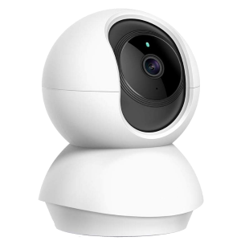

# ioBroker.cameras

[](https://www.npmjs.com/package/iobroker.cameras)
[](https://www.npmjs.com/package/iobroker.cameras)
[](https://david-dm.org/ioBroker/iobroker.cameras)
[](https://snyk.io/test/github/ioBroker/ioBroker.cameras)

[](https://nodei.co/npm/iobroker.cameras/)

**Tests:**: [](https://travis-ci.org/ioBroker/ioBroker.cameras)

## IP-Cameras adapter for ioBroker
You can integrate your web/ip cameras into vis and other visualizations.
If you configure a camera with name `cam1` it will be available on 
web server under `http(s)://iobroker-IP:8082/cameras.0/cam1`.

Additionally, the image could be requested via a message:
```
sendTo('cameras.0', 'image', {
    name: 'cam1', 
    width: 100, // optional 
    height: 50, // optional
    angle: 90   // optional
    noCache: true // optional, if you want to get the image not from cache
}, result => {
    const img = 'data:' + result.contentType + ';base64,' + result.data;
    console.log('Show image: ' + img);    
}); 
```

The result is always in `jpg` format.

Supported cameras:
- Reolink E1 Pro via RTSP (important, without `Pro` it will not work)
- Eufy via eusec adapter
- [HiKam](https://support.hikam.de/support/solutions/articles/16000070656-zugriff-auf-kameras-der-2-generation-via-onvif-f%C3%BCr-s6-q8-a7-2-generation-) of second and third generation via ONVIF (für S6, Q8, A7 2. Generation), A7 Pro, A9
- [WIWICam M1 via HiKam adapter](https://www.wiwacam.com/de/mw1-minikamera-kurzanleitung-und-faq/)
- RTSP Native - if your camera supports RTSP protocol
- Screenshots via HTTP URL - if you can get the snapshot from your camera via URL

### URL image
This is a normal URL request, where all parameters are in URL. Like `http://mycam/snapshot.jpg`  

### URL image with basic authentication
This is URL request for image, where all parameters are in URL, but you can provide the credentials for basic authentication. Like `http://mycam/snapshot.jpg`  

### FFmpeg
If you want to access snapshots on RTSP cameras, you can use ffmpeg. You need to install ffmpeg on your system:
- Windows has precompiled ffmpeg and there is no need to download anything. (Windows version is taken from here: https://www.gyan.dev/ffmpeg/builds/ffmpeg-git-essentials.7z) 
- Linux: `sudo apt-get install ffmpeg -y`

Here is an example of how to add Reolink E1:


## How to add a new camera (For developers)
To add a new camera, you must create a Pull Request on GitHub with the following changes:
- Add new file into `cameras` folder. This is a backend to read the single image from the camera. 
- Add GUI file in the `src/src/Types/` folder. This is the configuration dialog for the camera
- Add this dialog in `src/src/Tabs/Cameras.js` file analogical as other cameras are added. Only two lines should be added:
  - Import new configuration dialog like `import RTSPMyCamConfig from '../Types/RTSPMyCam';`
  - Extend `TYPES` structure with the new camera like `mycam: { Config: RTSPMyCamConfig, name: 'MyCam' },`
    The attribute name must be the same as the name of the file in the `cameras` folder.

## Todo
- [ ] Send new subscribe requests for RTSP cameras if the dialog is opened or closed 
<!--
	Placeholder for the next version (at the beginning of the line):
	### **WORK IN PROGRESS**
-->

## Changelog
### 2.0.7 (2024-06-09)
* (bluefox) Packages updated
* (bluefox) Allowed selecting another source (with bigger resolution) for URL cameras

### 2.0.5 (2023-12-19)
* (bluefox) Minimal supported Node.js version is 18
* (bluefox) Corrected widgets

### 1.4.0 (2023-12-04)
* (bluefox) Changed widget set name
* (bluefox) Added the caching of images with time, size and rotation
* (bluefox) Added timeout for RTSP cameras

### 1.3.0 (2023-09-28)
* (bluefox) Utilized the new js-controller feature: sendToUI. RTSP Streaming works only with js-controller 5.0.13 or higher
* (bluefox) Implemented a second widget for simple cameras

### 1.2.3 (2023-09-27)
* (bluefox) Added WiWiCam MW1 and HiKam cameras

### 1.2.2 (2023-07-07)
* (bluefox) Corrected passwords with exclamation mark

### 1.2.1 (2023-07-06)
* (bluefox) Added eufy camera

### 1.1.1 (2023-03-15)
* (bluefox) Added Reolink E1 camera

### 1.0.3 (2023-01-11)
* (bluefox) Corrected GUI config error

### 1.0.2 (2023-01-07)
* (bluefox) added RTSP camera
* (bluefox) added cache of snapshots

### 0.2.0 (2022-09-27)
* (bluefox) GUI updated to MUIv5

### 0.1.8 (2022-02-13)
* (bluefox) replaced the deprecated package `request` with `axios`

### 0.1.5 (2022-02-13)
* (bluefox) Preparations for js-controller@4.x are made

### 0.1.4 (2021-07-13)
* (bluefox) Add a role for states

### 0.1.3 (2020-08-08)
* (Hirsch-DE) Parameters were applied

### 0.1.2 (2020-06-03)
* (bluefox) implemented get image by message

### 0.1.0
* (bluefox) URL and URL with basic authentication were implemented

### 0.0.1
* (bluefox) initial release

## License
MIT License

Copyright (c) 2020-2024 bluefox <dogafox@gmail.com>

Permission is hereby granted, free of charge, to any person obtaining a copy
of this software and associated documentation files (the "Software"), to deal
in the Software without restriction, including without limitation the rights
to use, copy, modify, merge, publish, distribute, sublicense, and/or sell
copies of the Software, and to permit persons to whom the Software is
furnished to do so, subject to the following conditions:

The above copyright notice and this permission notice shall be included in all
copies or substantial portions of the Software.

THE SOFTWARE IS PROVIDED "AS IS", WITHOUT WARRANTY OF ANY KIND, EXPRESS OR
IMPLIED, INCLUDING BUT NOT LIMITED TO THE WARRANTIES OF MERCHANTABILITY,
FITNESS FOR A PARTICULAR PURPOSE AND NONINFRINGEMENT. IN NO EVENT SHALL THE
AUTHORS OR COPYRIGHT HOLDERS BE LIABLE FOR ANY CLAIM, DAMAGES OR OTHER
LIABILITY, WHETHER IN AN ACTION OF CONTRACT, TORT OR OTHERWISE, ARISING FROM,
OUT OF OR IN CONNECTION WITH THE SOFTWARE OR THE USE OR OTHER DEALINGS IN THE
SOFTWARE.
